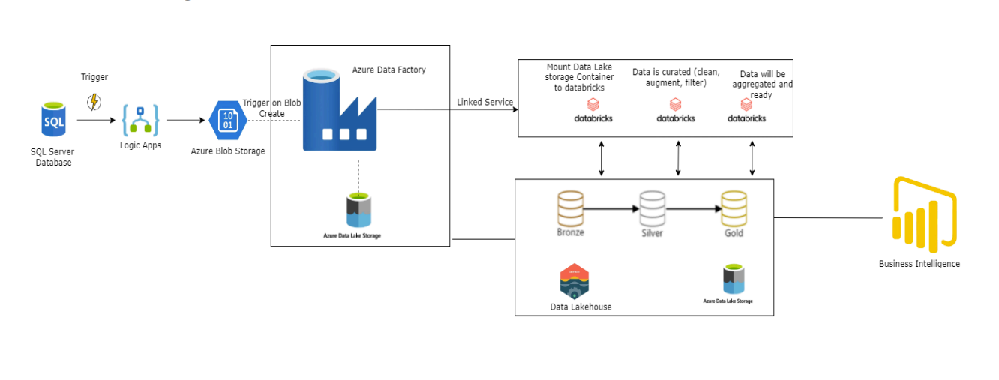

# Water Quality Data Pipeline using Azure Medallion Architecture


## Overview

This project builds an end-to-end data pipeline to analyze large sensor data collected from water bodies across different European countries over several years. It leverages Azure cloud services to ingest, store, transform, and visualize water quality data, applying the **Medallion Architecture** (Bronze → Silver → Gold) to progressively refine raw data into analytics-ready insights.

The pipeline processes over **1 million rows** of water sensor readings, covering determinands such as concentration levels (minimum, maximum, mean, median), monitoring sites, water body categories, and quality samples — all across multiple European countries and time periods.

---

## Architecture Diagram



---

## Power BI Dashboard


---

## What You Will Learn

- In-depth understanding of Azure services
- Configuration and implementation of on-premise SQL Server
- Creation of Azure SQL database and server
- Development of data ingestion workflows using Logic Apps
- Extraction of data from Azure-managed SQL Server database
- Establishment of Azure Blob Storage account
- Setup of Azure Data Lake Storage Gen2 account
- Creation of Azure Data Factory workspace
- Implementation of data pipelines in Azure Data Factory
- Configuration of computation cluster in Databricks workspace
- Implementation of Medallion Architecture for enhanced data quality
- Loading data from Databricks into Power BI
- Development of columns and measures using DAX in Power BI
- Creation of comprehensive dashboards in Power BI
- Implementation of automated creation of Azure services using Terraform

---

## Tech Stack

| Category | Tools / Services |
|---|---|
| **Programming** | SQL, Scala |
| **Data Ingestion** | Azure Logic Apps |
| **Storage** | Azure Blob Storage, Azure Data Lake Storage Gen2 |
| **Orchestration** | Azure Data Factory |
| **Processing** | Azure Databricks |
| **Database** | Azure Managed SQL, On-premise SQL Server |
| **Visualization** | Power BI |
| **Infrastructure as Code** | Terraform |

---

## Dataset Description

The dataset is a complex view of aggregated water sensor data with:

- **32 columns** and **1M+ rows**
- Collected across **multiple European countries** over several years
- Key fields include:
  - Country and water body category
  - Determinand types and monitoring sites
  - Concentration levels: minimum, maximum, mean, median
  - Quality sample counts and timestamps

---

## Solution Architecture

The project follows a structured pipeline approach across five stages:

### 1. Data Extraction
- Connect to **Azure Managed SQL Database** containing the raw dataset
- Use **Azure Logic App** to trigger and pull data from the SQL Database on a schedule
- Store extracted raw data in **Azure Blob Storage**

### 2. Data Storage Setup
- Create **Azure Data Lake Storage Gen2 (ADLS Gen2)** with hierarchical namespace enabled
- Move raw data from Blob Storage into ADLS Gen2 for scalable analytics storage

### 3. Data Orchestration
- Set up **Azure Data Factory (ADF)** to automate and manage data movement between services
- Schedule and monitor pipeline execution to ensure reliability and traceability

### 4. Medallion Architecture Implementation (Azure Databricks)

```
Raw Data (SQL DB)
      │
      ▼
┌─────────────┐
│ BRONZE LAYER│  → Raw, unprocessed data stored as-is for full traceability
└─────────────┘
      │
      ▼
┌─────────────┐
│ SILVER LAYER│  → Cleaned, validated, and standardized data
└─────────────┘
      │
      ▼
┌─────────────┐
│  GOLD LAYER │  → Curated, aggregated, analytics-ready datasets
└─────────────┘
      │
      ▼
   Power BI
```

| Layer | Description |
|---|---|
| **Bronze** | Raw ingested data stored without transformation for auditability |
| **Silver** | Cleaned and validated data — null handling, type casting, deduplication |
| **Gold** | Aggregated, business-ready data optimized for reporting and dashboards |

### 5. Visualization & Insights
- Load Gold layer datasets into **Power BI** via Hive Metastore
- Build interactive dashboards to surface water quality trends across countries, time periods, and determinand types

---

## Project Structure

```
├── Architecture.png                  # Solution architecture diagram
├── Power BI Dashboard.png            # Dashboard preview
├── Water quality visualization.pbit  # Power BI template file
├── Solution Document.pdf             # Detailed project documentation
├── Cookbook.pdf                      # Step-by-step project guide
├── Data.zip                          # Source dataset (CSV)
├── Project_Code.zip                  # Notebooks + Terraform code
├── Installation+&+Execution.zip      # Setup and execution guide
└── README.md
```

### Notebooks (inside `Project_Code.zip → Code/`)

| Notebook | Description |
|---|---|
| `Bronze_Layer.ipynb` | Ingests raw data from ADLS Gen2 into the Bronze Delta table |
| `Silver_Layer.ipynb` | Cleans and validates Bronze data into the Silver layer |
| `Gold_Layer.ipynb` | Aggregates Silver data into curated Gold tables |
| `Delta_Live_Table.ipynb` | Implements Delta Live Tables pipeline for automated processing |

### Terraform (inside `Project_Code.zip → Terraform/`)

| File | Description |
|---|---|
| `main.tf` | Defines all Azure resources (Storage, ADF, Databricks, etc.) |
| `providers.tf` | Azure provider configuration |
| `secrets.tfvars` | Variable values (credentials — **do not commit to public repos**) |
| `Instructions.md` | Step-by-step guide to run Terraform |
| `Terraform Commands.txt` | Quick reference for Terraform CLI commands |

---

## Getting Started

### Prerequisites

- Azure subscription (free tier works for most services)
- [Terraform](https://developer.hashicorp.com/terraform/install) installed locally
- [Power BI Desktop](https://powerbi.microsoft.com/desktop/) installed
- SQL Server Management Studio (SSMS) or Azure Data Studio
- Access Database Engine (for `.xlsx` import — included in `Installation & Execution`)

### Step 1 — Provision Azure Infrastructure with Terraform

```bash
# Navigate to the Terraform directory
cd Project_Code/Terraform

# Initialise Terraform
terraform init

# Preview the resources to be created
terraform plan -var-file="secrets.tfvars"

# Deploy all Azure resources
terraform apply -var-file="secrets.tfvars"
```

> See `Instructions.md` inside the Terraform folder for a detailed walkthrough.

### Step 2 — Load Data into Azure SQL Database

1. Install Access Database Engine (included in `Installation & Execution`)
2. Open SQL Server Management Studio and connect to the Azure SQL Server
3. Import the dataset from `Data/` using the SQL Import Wizard
4. Verify row counts match expected 1M+ rows

### Step 3 — Configure and Trigger Logic App

1. In the Azure Portal, navigate to your Logic App
2. Configure the SQL connector to point to your Azure SQL Database
3. Set the trigger schedule and storage output (Blob Storage)
4. Run a manual trigger to validate data flows to Blob Storage

### Step 4 — Run Azure Data Factory Pipeline

1. Open your ADF workspace
2. Verify linked services for Blob Storage and ADLS Gen2
3. Trigger the pipeline to move data from Blob to ADLS Gen2
4. Monitor pipeline runs in the ADF Monitor tab

### Step 5 — Run Databricks Notebooks

Execute the notebooks in order within your Databricks workspace:

1. `Bronze_Layer.ipynb` — load raw data into Delta Bronze table
2. `Silver_Layer.ipynb` — clean and validate into Silver
3. `Gold_Layer.ipynb` — aggregate into Gold tables
4. (Optional) `Delta_Live_Table.ipynb` — for automated DLT pipeline

### Step 6 — Connect Power BI

1. Open `Water quality visualization.pbit` in Power BI Desktop
2. Connect to your Databricks workspace using the Hive endpoint
3. Refresh the dataset
4. Explore the dashboards or publish to Power BI Service

---

## Dashboard Highlights

The Power BI dashboard provides insights including:

- 🌊 Water quality trends over time by country
- 📊 Determinand concentration levels (min, max, mean, median) across monitoring sites
- 🗺️ Geographic distribution of water body categories across Europe
- ✅ Quality sample pass/fail ratios per observation period
- 📈 Year-over-year trend analysis per determinand type


---

## License

This project is for educational purposes. Dataset sourced from European water quality monitoring programs.
